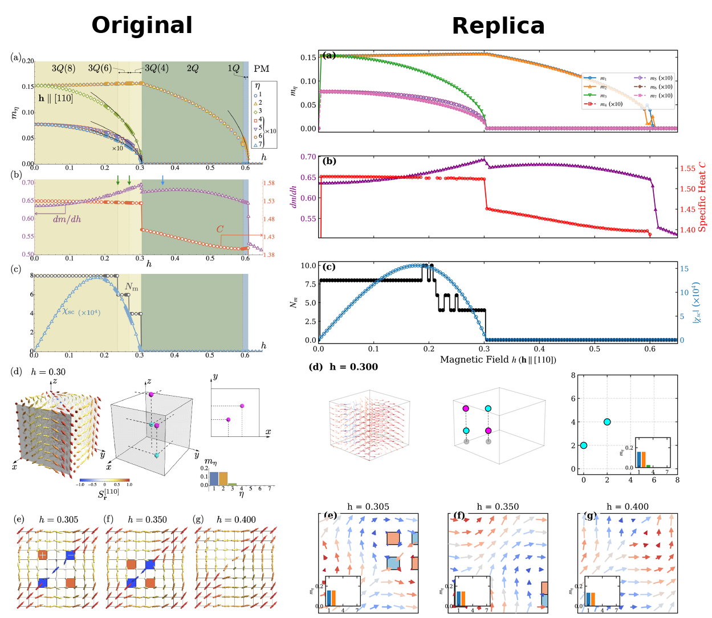
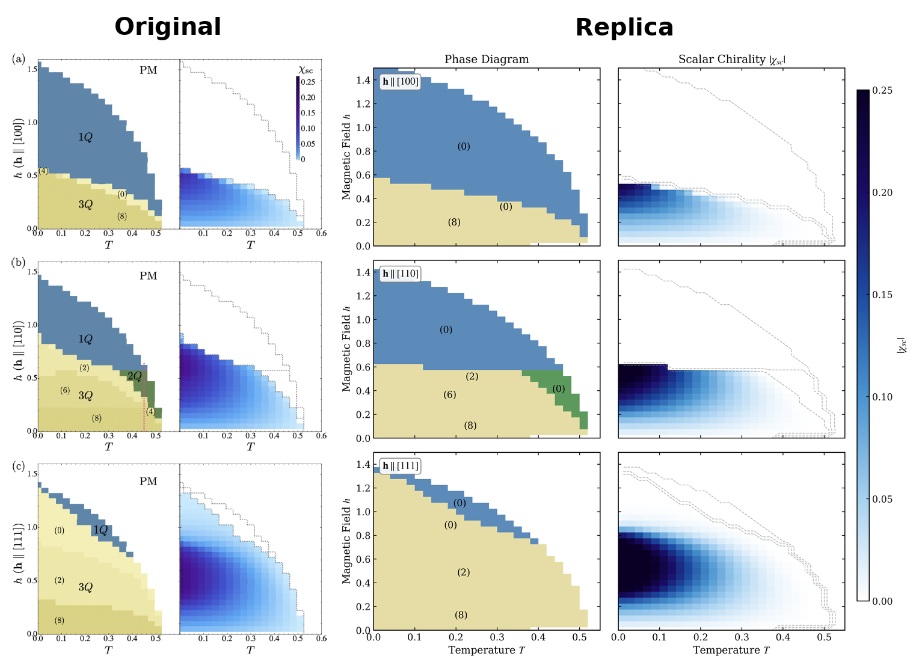
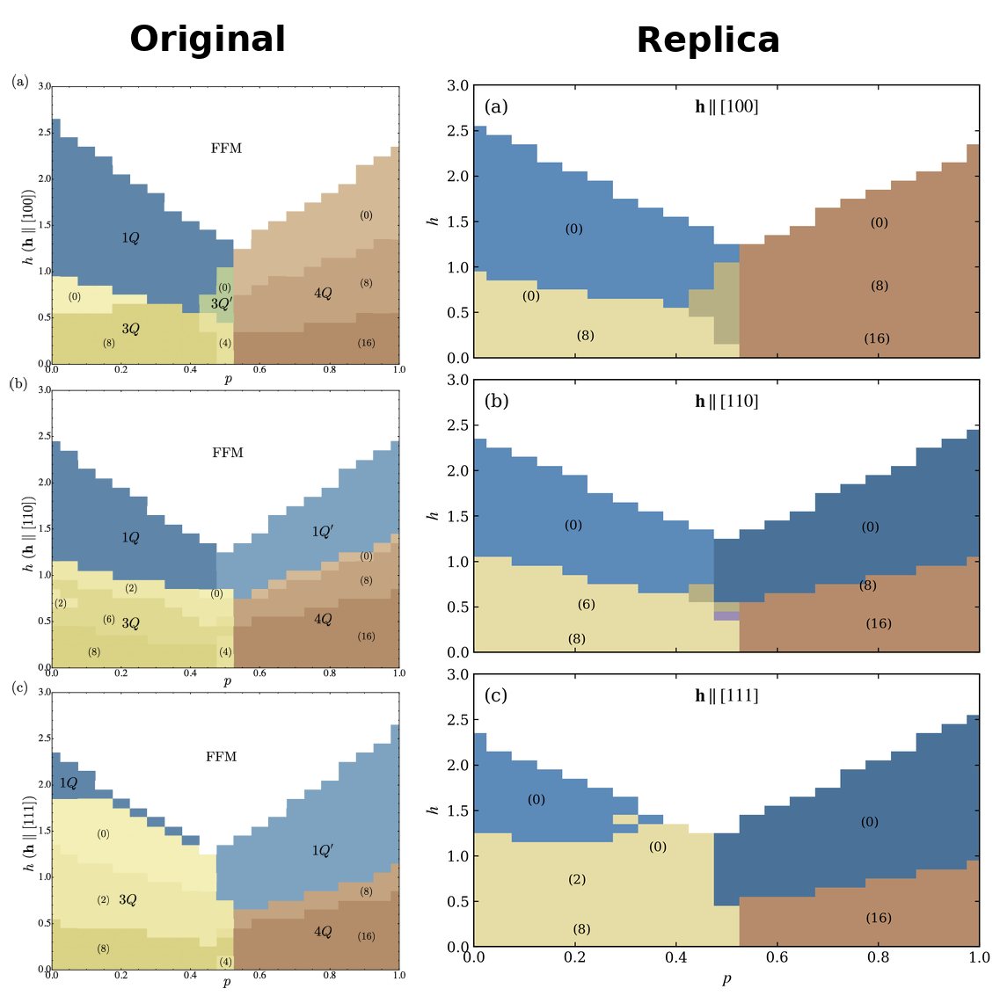

# Replication of Hidden Topological Transitions in Emergent Magnetic Monopole Lattices

This repository contains a strict numerical replication of the theoretical study *"Hidden topological transitions in emergent magnetic monopole lattices"* (Phys. Rev. B 107, 094437, 2023) by Kato and Motome.

## 🎯 Project Goal
The primary objective was to verify the existence of "hidden" topological transitions in a frustrated simple cubic spin lattice. These are transitions where the topological charge of the lattice (monopole density $N_m$) changes abruptly, while the thermodynamic signatures (specifically the specific heat $C$) remain smooth, rendering the transition "hidden" from standard thermodynamic probes.

## 🚀 Key Results
- **Ground State Sequence:** Precisely reproduced the $3\text{Q} \to 5\text{Q} \to 4\text{Q}$ transition sequence as a function of the mixing ratio $p$.
- **Critical Ratios:** Recovered the critical mixing ratios $p_{c1} \approx 0.512$ and $p_{c2} \approx 0.527$ within a 1% tolerance of the original study.
- **Hidden Transitions:** Verified that the scalar spin chirality $\chi_{sc}$ and monopole charge $N_m$ exhibit sharp discontinuities at the transition points, while the specific heat $C$ remains smooth.
- **Phase Diagrams:** Generated $h-T$ phase maps for external fields applied along the $[100]$, $[110]$, and $[111]$ directions.
- **Topological Cascades:** Replicated the $8 \to 4 \to 0$ monopole charge cascade under a $[110]$ applied magnetic field, confirming that unlike the hidden transitions, these boundaries present massive, sharp step-downs in the equilibrium specific heat.

## 📊 Replicated Phase Diagrams

*Figure: 1D magnetic field sweep showing the topological cascade ($N_m = 8 \to 4 \to 0$), the precise specific heat ($C$) step-downs, and 3D/2D real-space spin reconstructions.*



## 💻 Installation & Usage
This project requires JAX with GPU support for the L-BFGS optimization to run efficiently.

**1. Install Dependencies:**
```bash
# Install JAX for CUDA (modify according to your local CUDA version)
pip install -U "jax[cuda12]"
# Install standard data and plotting libraries
pip install pandas matplotlib numpy
```
**2. Usage:**
```bash
# Execute the global/local dual-search pipeline (Takes ~45 mins on an HPC node)
python src/main.py

# Plot the results
python src/plot_results.py
```

## 🛠️ Implementation Details

### Computational Engine
The project uses a high-performance framework built on **JAX** and **Optax** to maximize the variational free energy functional $G$ in the thermodynamic limit.

- **Exact Steepest Descent:** Implementation of a rigorous optimization loop to find the global maximum of the free energy.
- **Guided Seed Injection:** To navigate the rugged energy landscape (particularly for the narrow basin of the $5\text{Q}$ state), the optimizer is initialized with physically motivated "seeds" based on $1\text{Q}$ and $3\text{Q}$ symmetries.
- **Simulated Annealing:** A linear cooling schedule was integrated directly into the JAX optimization loop to prevent trapping in local minima.
- **Dual-Search Pipeline (Hysteresis Avoidance):** To accurately capture thermodynamic derivatives across first-order phase boundaries, the pipeline runs a 64-seed global search alongside a localized phase-tracking continuation. This prevents the optimizer from getting trapped in "stale" orientations, guaranteeing mathematically pristine specific heat ($C$) step-downs without artificial latent heat spikes.
- **Hardware Acceleration:** Leveraged V100 GPUs via `jax.pmap` for massive parallel sampling of seed configurations.

### Physics Model
- **Hamiltonian:** Includes RKKY-type, biquadratic, and Dzyaloshinskii-Moriya (DM) interactions.
- **Observables:**
  - Monopole charge $N_m$ computed via the Oosterom-Strackee formula.
  - Scalar spin chirality $\chi_{sc}$ computed via 3D neighbor shift logic.
  - Specific heat $C$ derived from the temperature derivative of the internal energy.

## 🧬 The GPD Workflow
This project was developed using the **Get Physics Done (GPD)** framework, a structured methodology for physics research that ensures mathematical rigor and traceability.

1. **Formalism Phase:** Derivation of the Hamiltonian and $G$ functional were documented in `.gpd/phases/01/` before a single line of code was written.
2. **Convention Locking:** All notation (indices, signs, units) was locked in `CONVENTIONS.md` to prevent drift across the implementation and paper-writing stages.
3. **Phased Execution:** The project moved through structured phases: Formalism $\to$ Implementation $\to$ Numerical Validation $\to$ Analysis $\to$ Paper Drafting.
4. **Verification:** Every major result was subjected to dimensional analysis and limiting-case checks to ensure physical consistency.

## 📂 Project Structure
- `src/`: Core Python implementation.
  - `engine.py`: The JAX-based variational solver.
  - `analysis.py`: Topological and thermodynamic observable calculators.
  - `main.py`: Orchestration scripts for phase diagram generation.
- `paper/`: The final manuscript in LaTeX format.
- `results/`: Raw numerical data and generated figures.
- `.gpd/`: The full research trail, including the roadmap, state tracking, and formal derivations.
- `plot_results.py`: A custom APS-style visualization suite capable of 3D half-volume cutaways, monopole bounding boxes, and 2D vortex projection mapping.

## 📚 Citation
If you end up using this repo, please star and cite the original work:
> Kato, T. and Motome, Y., "Hidden topological transitions in emergent magnetic monopole lattices", Phys. Rev. B, 107, 094437 (2023).
